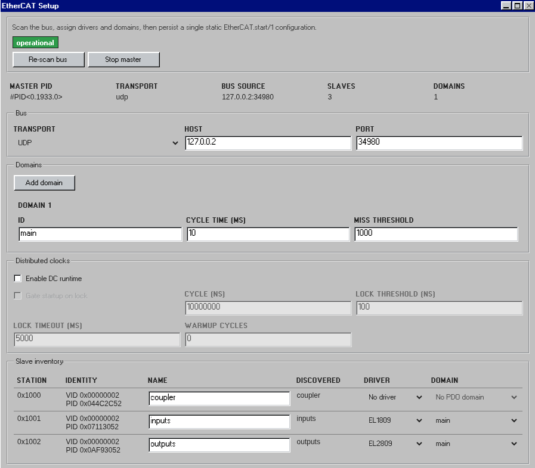

# EtherCAT

[](https://hex.pm/packages/ethercat)
[](https://hexdocs.pm/ethercat)
[](https://github.com/sid2baker/ethercat/blob/main/LICENSE)

> **Disclaimer:** This repo is not ready for production yet. I’m exploring
> where soft-real-time devices fit in automation and would like to develop this
> into a bachelor’s thesis. If you know a professor, or someone who could help
> me pursue that, feel free to reach out! :)



Pure-Elixir EtherCAT master built on OTP.

- No NIF.
- No kernel module.
- Nerves-first, runs on standard Linux too.
- Minimal runtime dependency surface.
- Best for discrete I/O, Beckhoff terminal stacks, diagnostics, and 1 ms to 10 ms cyclic loops.
- Not the right fit for sub-millisecond hard real-time control.

The entry idea is simple: the **master owns the session lifecycle**, **domains own cyclic LRW exchange**, **slaves own ESM and slave-local configuration**, and **DC owns clock discipline**. Critical domain/DC runtime faults move the public state to `:recovering`; slave-local faults are tracked separately so healthy cyclic parts can stay up.

Runtime footprint is intentionally small: no NIFs, no kernel module, and only a
minimal runtime dependency surface. The library talks to Linux directly through
raw sockets, sysfs, and OTP, with `:telemetry` as the only runtime Hex
dependency.

## Installation

Latest Hex release:

```elixir
def deps do
  [{:ethercat, "~> 0.4.2"}]
end
```

For release notes and post-`0.4.2` work, see the
[changelog](https://github.com/sid2baker/ethercat/blob/main/CHANGELOG.md).

If you want the current `main` branch instead of the latest Hex cut:

```elixir
def deps do
  [{:ethercat, github: "sid2baker/ethercat", branch: "main"}]
end
```

Raw Ethernet socket access requires `CAP_NET_RAW` or root. Grant that
capability to the BEAM executable that will run the master:

```bash
BEAM=$(readlink -f "$(dirname "$(dirname "$(command -v erl)")")"/erts-*/bin/beam.smp)
sudo setcap cap_net_raw+ep "$BEAM"
```

Link monitoring is handled internally.

## Quick Start

### Discover a ring

```elixir
{:ok, scan} = EtherCAT.Scan.scan({:raw, %{interface: "eth0"}})

EtherCAT.start(backend: {:raw, %{interface: "eth0"}})

:ok = EtherCAT.await_running()

EtherCAT.state()
#=> :preop_ready

EtherCAT.Master.status()
#=> %EtherCAT.Master.Status{backend: %EtherCAT.Backend.Raw{interface: "eth0"}, ...}

EtherCAT.Diagnostics.slaves()
#=> [
#=>   %{name: :slave_0, station: 0x1000, server: {:via, Registry, ...}, pid: #PID<...>},
#=>   ...
#=> ]

EtherCAT.stop()
```

If you start without explicit slave configs, EtherCAT still scans the ring, names each
station, and brings every slave to `:preop`. That is the right entry point for
exploration, diagnostics, and dynamic configuration.

### Run driver-backed slave I/O

```elixir
defmodule MyApp.EL1809 do
  @behaviour EtherCAT.Driver

  @impl true
  def signal_model(_config, _sii_pdo_configs), do: [ch1: 0x1A00]

  @impl true
  def encode_signal(_signal, _config, _value), do: <<>>

  @impl true
  def decode_signal(_signal, _config, <<_::7, bit::1>>), do: bit
  def decode_signal(_signal, _config, _), do: 0

  @impl true
  def describe(_config) do
    %{
      device_type: :digital_input,
      endpoints: [
        %EtherCAT.Endpoint{
          signal: :ch1,
          name: :ch1,
          direction: :input,
          type: :boolean
        }
      ],
      commands: []
    }
  end

  @impl true
  def init(_config), do: {:ok, %{}}

  @impl true
  def project_state(decoded_inputs, _prev_state, driver_state, _config) do
    next_state = %{ch1: Map.get(decoded_inputs, :ch1, 0) == 1}
    {:ok, next_state, driver_state, [], []}
  end

  @impl true
  def command(command, _state, _driver_state, _config),
    do: EtherCAT.Driver.unsupported_command(command)
end

EtherCAT.start(
  backend: {:raw, %{interface: "eth0"}},
  domains: [%EtherCAT.Domain.Config{id: :io, cycle_time_us: 1_000}],
  slaves: [
    %EtherCAT.Slave.Config{name: :coupler},
    %EtherCAT.Slave.Config{
      name: :inputs,
      driver: MyApp.EL1809,
      aliases: %{ch1: :part_at_stop?},
      process_data: {:all, :io},
      target_state: :op
    },
    %EtherCAT.Slave.Config{
      name: :outputs,
      driver: MyApp.EL2809,
      aliases: %{ch1: :run_lamp?},
      process_data: {:all, :io},
      target_state: :op
    }
  ]
)

:ok = EtherCAT.await_operational()

{:ok, input_snapshot} = EtherCAT.snapshot(:inputs)
input_snapshot.state.part_at_stop?
#=> false

{:ok, input_description} = EtherCAT.describe(:inputs)
input_description.endpoints
#=> [%EtherCAT.Endpoint{signal: :ch1, name: :part_at_stop?, direction: :input, type: :boolean}]

{:ok, inventory} = EtherCAT.inventory()
Map.keys(inventory)
#=> [:coupler, :inputs, :outputs]

EtherCAT.subscribe(:inputs)
#=> receive %EtherCAT.Event{
#=>   kind: :signal_changed,
#=>   signal: {:inputs, :part_at_stop?},
#=>   slave: :inputs,
#=>   value: true,
#=>   cycle: 42,
#=>   updated_at_us: timestamp_us
#=> }

{:ok, ref} =
  EtherCAT.command(:outputs, :set_output, %{endpoint: :run_lamp?, value: true})
#=> later receive %EtherCAT.Event{kind: :event, data: {:command_completed, ^ref}, ...}
```

Drivers still own the raw PDO mapping, but the public API is now slave-first:
`slaves/0`, `snapshot/0`, `snapshot/1`, `describe/1`, `inventory/0`,
`subscribe/2`, and `command/3`. Drivers expose native endpoints, slave config
may alias them, and the public runtime surface uses those effective endpoint
names. `describe/1` and `inventory/0` are configuration-backed interface
views; `snapshot/0` and `snapshot/1` remain the live value image. If you need
direct process-data access for diagnostics or low-level tooling, use
`EtherCAT.Raw.read_input/2`,
`EtherCAT.Raw.write_output/3`, and `EtherCAT.Raw.subscribe/3`.

The runtime owns the retained driver-backed slave state, including staged
outputs, and derives normal `%EtherCAT.Event{kind: :signal_changed}` deltas by
diffing that alias-applied public state image. Drivers project slave state and
may emit command lifecycle updates through the same top-level event stream.

`EtherCAT.subscribe(:all)` follows the runtime-wide slave event stream,
including slaves that appear after the subscription is created.

For PREOP-first workflows, configure discovered slaves dynamically:

```elixir
EtherCAT.start(
  backend: {:raw, %{interface: "eth0"}},
  domains: [%EtherCAT.Domain.Config{id: :main, cycle_time_us: 1_000}]
)

:ok = EtherCAT.await_running()

:ok =
  EtherCAT.Provisioning.configure_slave(
    :slave_1,
    driver: MyApp.EL1809,
    process_data: {:all, :main},
    target_state: :op
  )

:ok = EtherCAT.Provisioning.activate()
:ok = EtherCAT.await_operational()
```

### Capture a real slave into a simulator scaffold

```bash
iex -S mix ethercat.capture --interface eth0
```

Then, from IEx:

```elixir
EtherCAT.Capture.list_slaves()
EtherCAT.Capture.write_capture(:slave_1, sdos: [{0x1008, 0x00}])
EtherCAT.Capture.gen_simulator(:slave_1, module: MyApp.EL1809.Simulator)
```

This capture flow writes a data-only capture artifact, then preserves static
structure: identity, mailbox layout, PDO shape, and any explicit SDO snapshots
you request. It does not infer dynamic behavior or a complete object
dictionary automatically.

## Runtime Roles

- `EtherCAT.Backend` describes the transport/backend the master or simulator uses.
- `EtherCAT.Scan.scan/1` returns an observational `%EtherCAT.Scan.Result{}` without starting the master, and refuses to probe a backend already owned by the running master.
- `EtherCAT.Master.status/0` returns the current `%EtherCAT.Master.Status{}` runtime view.
- `EtherCAT.Simulator.status/0` returns the current `%EtherCAT.Simulator.Status{}` runtime view.

## Mental Model

- The master owns startup, activation-blocked startup, and runtime recovery decisions.
- The bus is the single serialization point for all frames.
- Domains own logical PDO images and cyclic LRW exchange.
- Drivers own PDO decode/encode plus projected-state updates, faults, and specialist commands.
- Slaves own AL transitions and bind drivers into the runtime.
- DC owns distributed-clock initialization, lock monitoring, and runtime maintenance.

If you understand those five roles, the rest of the API is predictable.

The normal application-facing surface is `EtherCAT`. Provisioning, diagnostics,
raw PDO access, and driver authoring live under `EtherCAT.Provisioning`,
`EtherCAT.Diagnostics`, `EtherCAT.Raw`, and `EtherCAT.Driver`. The runtime
still uses `Master`, `Slave`, `Domain`, and `DC` internally to model the
session, but those are specialist entry points now.

## Lifecycle

Public startup and runtime health are exposed through `EtherCAT.state/0`:

- `:idle` — no live session
- `:discovering` — bus scan and startup are still in progress
- `:awaiting_preop` — configured slaves are still converging on PREOP
- `:preop_ready` — the session is usable and held in PREOP
- `:deactivated` — the session is live but intentionally settled below OP
- `:operational` — cyclic OP is running
- `:activation_blocked` — requested transitions could not be completed
- `:recovering` — a critical runtime fault is being healed

`await_running/1` waits for a usable session and returns activation/configuration
errors directly if startup cannot reach one. `await_operational/1` waits for
cyclic OP. Inspect `EtherCAT.Diagnostics.slaves/0` for non-critical per-slave
fault state.

For detailed state diagrams and sequencing, see the specialist moduledocs:
- `EtherCAT.Master` — startup, activation, and recovery orchestration
- `EtherCAT.Slave` — ESM transitions and AL control
- `EtherCAT.Domain` — cyclic LRW exchange states
- `EtherCAT.DC` — distributed-clock lock tracking

## Failure Model

- A slave disconnect does not automatically mean full-session teardown.
- Critical domain or DC faults move the master to `:recovering`.
- Non-critical slave-local faults stay attached to the affected slave and are visible through `EtherCAT.Diagnostics.slaves/0`.
- Healthy domains can keep cycling if the fault is localized and the transport is still usable.
- Total bus loss can stop domains after the configured miss threshold; recovery can restart them.
- Slave reconnect is PREOP-first: the slave rebuilds its local state, then the master decides when to return it to OP.
- Slaves held in `:preop` or `:safeop` still health-poll for disconnects and lower-state regressions.

The maintained end-to-end hardware walkthrough is
`MIX_ENV=test mix run test/integration/hardware/scripts/fault_tolerance.exs --interface <eth-iface>`.

## Where To Start

### Fastest path

[`kino_ethercat`](https://github.com/sid2baker/kino_ethercat) gives you an
interactive UI for ring discovery, I/O control, and diagnostics.

### No hardware yet

Use `EtherCAT.Simulator` to drive the real master against a simulated ring.
That is the fastest way to exercise startup, mailbox, recovery, and fault
handling without a physical EtherCAT stack on your desk.

### Maintained hardware scripts

The repo ships maintained hardware scripts under `test/integration/hardware/`.
Run them with `MIX_ENV=test mix run test/integration/hardware/scripts/<script>.exs ...`
because they reuse support modules compiled only in test env. See
`test/integration/hardware/README.md` for the maintained script matrix and flags.

Recommended first stops:

- `test/integration/hardware/scripts/scan.exs`
- `test/integration/hardware/scripts/diag.exs`
- `test/integration/hardware/scripts/wiring_map.exs`
- `test/integration/hardware/scripts/dc_sync.exs`
- `test/integration/hardware/scripts/fault_tolerance.exs`
- `test/integration/hardware/scripts/redundant_replug_watch.exs` for live redundant-link topology and reconnect watching

### Deeper architecture

- [`ARCHITECTURE.md`](https://github.com/sid2baker/ethercat/blob/main/ARCHITECTURE.md) for subsystem boundaries and data flow
- [`hexdocs.pm/ethercat`](https://hexdocs.pm/ethercat) for the API reference
