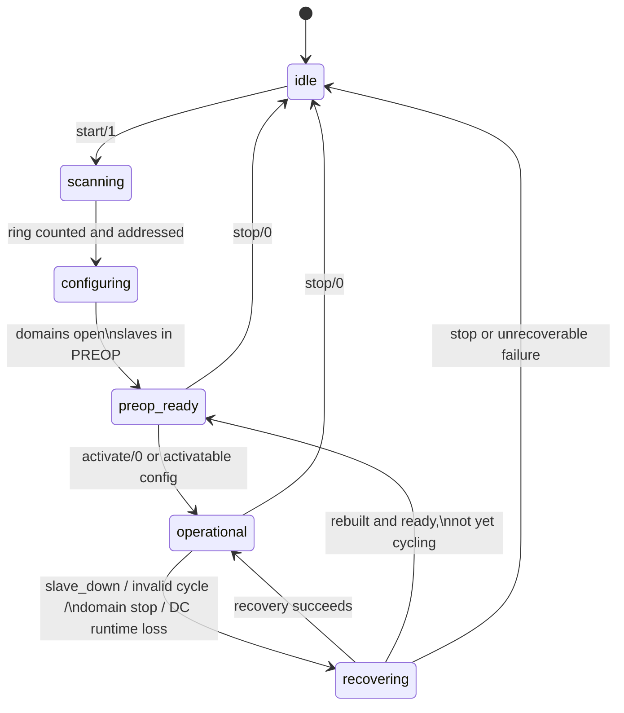
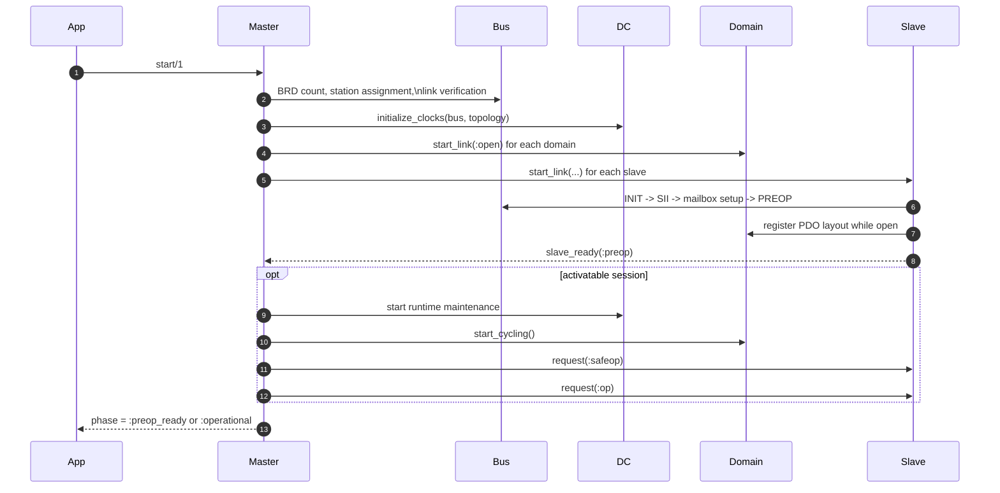
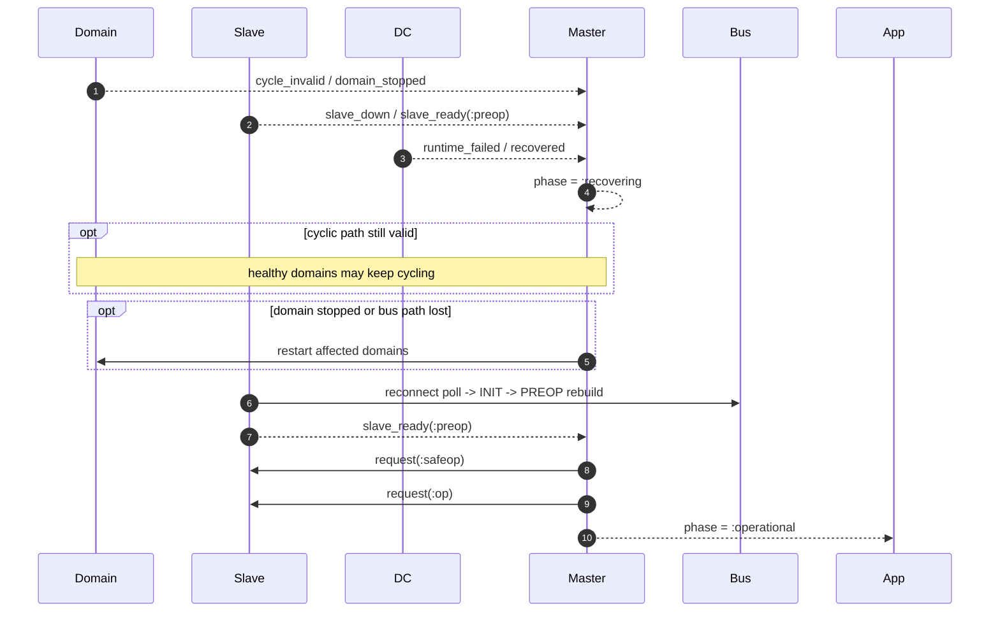

# EtherCAT

[](https://hex.pm/packages/ethercat)
[](https://hexdocs.pm/ethercat)
[](https://github.com/sid2baker/ethercat/blob/main/LICENSE)

[](https://www.youtube.com/watch?v=huwbTsmTPHc)

Pure-Elixir EtherCAT master built on OTP.

- No NIF.
- No kernel module.
- Nerves-first, runs on standard Linux too.
- Best for discrete I/O, Beckhoff terminal stacks, diagnostics, and 1 ms to 10 ms cyclic loops.
- Not the right fit for sub-millisecond hard real-time control.

The entry idea is simple: the **master owns the session lifecycle**, **domains own cyclic LRW exchange**, **slaves own ESM and slave-local configuration**, and **DC owns clock discipline**. When runtime faults happen, the public phase moves to `:recovering`, healthy parts keep running when possible, and the master decides how to recover.

## Installation

```elixir
def deps do
  [{:ethercat, "~> 0.1.0"}]
end
```

Raw Ethernet socket access requires `CAP_NET_RAW` or root:

```bash
sudo setcap cap_net_raw+ep _build/dev/lib/ethercat/priv/raw_socket
```

## Quick Start

### Discover a ring

```elixir
EtherCAT.start(interface: "eth0")

:ok = EtherCAT.await_running()

EtherCAT.phase()
#=> :preop_ready

EtherCAT.slaves()
#=> [
#=>   %{name: :slave_0, station: 0x1000, server: {:via, Registry, ...}, pid: #PID<...>},
#=>   ...
#=> ]

EtherCAT.stop()
```

If you start without explicit slave configs, EtherCAT still scans the ring, names each
station, and brings every slave to `:preop`. That is the right entry point for
exploration, diagnostics, and dynamic configuration.

### Run cyclic PDO I/O

```elixir
defmodule MyApp.EL1809 do
  @behaviour EtherCAT.Slave.Driver

  def process_data_model(_), do: [ch1: 0x1A00]
  def encode_signal(_, _, _), do: <<>>
  def decode_signal(_, _, <<_::7, bit::1>>), do: bit
  def decode_signal(_, _, _), do: 0
end

EtherCAT.start(
  interface: "eth0",
  domains: [%EtherCAT.Domain.Config{id: :io, cycle_time_us: 1_000}],
  slaves: [
    %EtherCAT.Slave.Config{name: :coupler},
    %EtherCAT.Slave.Config{
      name: :inputs,
      driver: MyApp.EL1809,
      process_data: {:all, :io},
      target_state: :op
    }
  ]
)

:ok = EtherCAT.await_operational()

EtherCAT.subscribe(:inputs, :ch1)
{:ok, bit} = EtherCAT.read_input(:inputs, :ch1)
```

For PREOP-first workflows, configure discovered slaves dynamically:

```elixir
EtherCAT.start(
  interface: "eth0",
  domains: [%EtherCAT.Domain.Config{id: :main, cycle_time_us: 1_000}]
)

:ok = EtherCAT.await_running()

:ok =
  EtherCAT.configure_slave(
    :slave_1,
    driver: MyApp.EL1809,
    process_data: {:all, :main},
    target_state: :op
  )

:ok = EtherCAT.activate()
:ok = EtherCAT.await_operational()
```

## Mental Model

- The master owns startup, activation, degraded mode, and recovery decisions.
- The bus is the single serialization point for all frames.
- Domains own logical PDO images and cyclic LRW exchange.
- Slaves own AL transitions, SII/mailbox/PDO setup, and signal decode/encode.
- DC owns distributed-clock initialization, lock monitoring, and runtime maintenance.

If you understand those five roles, the rest of the API is predictable.

## Lifecycle

Public startup and runtime health are exposed through `EtherCAT.phase/0`:

- `:idle`
- `:scanning`
- `:configuring`
- `:preop_ready`
- `:operational`
- `:degraded`
- `:recovering`

`await_running/1` waits for a usable session. `await_operational/1` waits for cyclic OP.

### 1. Master-owned lifecycle

This is the actual user-facing model. Recovery is master-owned; the public recovery
phase is `:recovering` until the cyclic path is healthy again.



### 2. Startup sequencing across subsystems



### 3. Runtime fault recovery

This library aims for BEAM-friendly fault tolerance: keep healthy work running when
possible, surface faults explicitly, and let the master own recovery policy.



## Failure Model

- A slave disconnect does not automatically mean full-session teardown.
- Invalid WKC or slave health loss moves the master to `:recovering`.
- Healthy domains can keep cycling if the fault is localized and the transport is still usable.
- Total bus loss can stop domains after the configured miss threshold; recovery can restart them.
- Slave reconnect is PREOP-first: the slave rebuilds its local state, then the master decides when to return it to OP.

The maintained end-to-end hardware walkthrough for this is:

- [`examples/fault_tolerance.exs`](examples/fault_tolerance.exs)

## Where To Start

### Fastest path

[`kino_ethercat`](https://github.com/sid2baker/kino_ethercat) gives you interactive
Livebook cells for ring discovery, I/O control, and diagnostics.

### Maintained hardware examples

See [`examples/README.md`](examples/README.md) for the maintained scripts and Livebooks.
Recommended first stops:

- `examples/scan.exs`
- `examples/diag.exs`
- `examples/wiring_map.exs`
- `examples/dc_sync.exs`
- `examples/fault_tolerance.exs`

### Deeper architecture

- [`ARCHITECTURE.md`](https://github.com/sid2baker/ethercat/blob/main/ARCHITECTURE.md) for subsystem boundaries and data flow
- [`hexdocs.pm/ethercat`](https://hexdocs.pm/ethercat) for the API reference

## Mapping Rules

- High-level `%EtherCAT.Domain.Config{}` periods currently use a whole-millisecond scheduling contract with a minimum of `1_000 us`.
- High-level `EtherCAT.start/1` domain configs do not take `logical_base`; the master allocates logical windows automatically.
