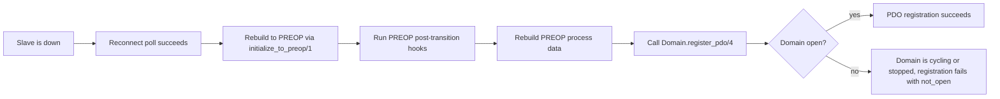
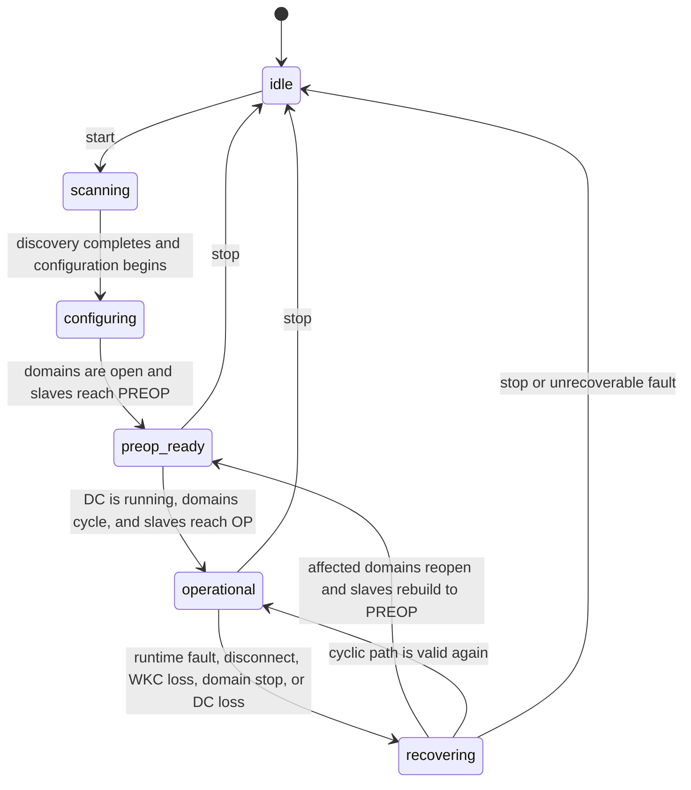
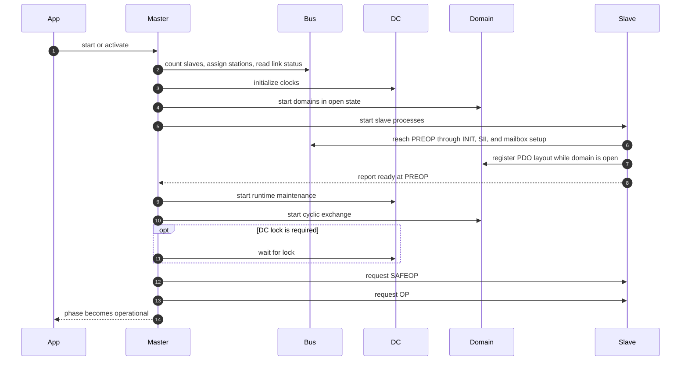
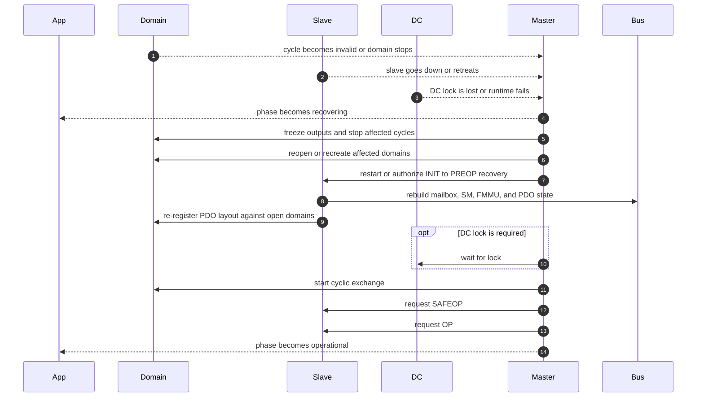

# Lifecycle Spec Alignment Review

Date: 2026-03-08

Reviewed commit: `4f477f392ed58e9a456b3e205313811b199aebbd` (`feat(resilience): slave disconnect resilience with :down state`)

## Status Update

This review is historically important, but it no longer describes the current
runtime as a whole.

The main issues identified here have since been addressed:

- runtime recovery is now master-owned
- public runtime-fault reporting uses `:recovering`
- slave reconnect requires master authorization
- split `{domain, SyncManager}` attachments and attachment-aware reconnect
  caches are landed

What still remains relevant from this review:

- use it as rationale for why recovery ownership lives in `Master`
- use it as background when evaluating future `Domain` invalid-cycle behavior
- treat it as historical analysis, not as the live architecture contract

## Scope

This review aligns the current `Master`, `Slave`, `Domain`, and `DC` lifecycles against the local EtherCAT reference index:

- `docs/references/ethercat-spec/01-llm-reference-index.md`

The main reference set for this review is:

- chapters 04-07 for WKC and ESM semantics
- chapters 11-13 for SyncManager/FMMU/PDO ownership
- chapters 14-16 for DC initialization and runtime maintenance
- chapters 17-20 for startup and continuous-loop behavior
- chapter 21 for the master-owned recovery state

## Alignment Map

| Subsystem | Primary chapters | Required responsibilities |
| --- | --- | --- |
| `Master` | 17-21 | scan, station assignment, topology read, session orchestration, startup sequencing, runtime recovery |
| `Slave` | 05-07, 18-19 | execute AL transitions, validate errors, configure mailbox and process-data path at the right ESM point |
| `Domain` | 04, 11-13, 20 | own logical image layout, enforce exact LRW WKC validation, provide safe cyclic-state transitions |
| `DC` | 14-16, 19-20 | initialize offsets/delays, maintain reference-time discipline, classify lock quality, surface runtime loss to the master |

## Overall Assessment

The architecture is still sound at a high level:

- `Master` owns bus/session startup
- `Slave` owns AL transitions and slave-local configuration
- `Domain` owns logical process-data images
- `DC` owns distributed-clock initialization and runtime maintenance

The problem introduced by the latest resilience work is not that fault detection is missing. It is that runtime recovery ownership is split in the wrong place. The new `Slave :down` path attempts to self-heal by re-running PREOP setup, but PREOP setup still assumes domains are in their startup-only `:open` registration phase. That makes the recovery path structurally incompatible with the existing domain lifecycle.

## Findings

### 1. Critical: reconnect recovery cannot succeed while domains keep cycling

Current behavior:

- `Domain.register_pdo/4` accepts registrations only in `:open` (`lib/ethercat/domain.ex:231-243`).
- `Slave` reconnects from `:down` by calling `initialize_to_preop/1` (`lib/ethercat/slave.ex:646-662`).
- `post_transition(:preop, ...)` always re-runs `configure_preop_process_data/1` (`lib/ethercat/slave.ex:1163-1171`).
- PREOP process-data setup always reaches `Domain.register_pdo/4` through `apply_process_data_groups/2` (`lib/ethercat/slave.ex:765-795`, `lib/ethercat/slave.ex:929-964`).

That means a physically reconnected slave tries to rebuild PDO/FMMU registration against a domain that is still in `:cycling` or `:stopped`, not `:open`. The new path therefore bottoms out at `{:error, :not_open}` instead of completing recovery.

Spec alignment:

- `docs/references/ethercat-spec/18-the-configuration-sequence-init-to-pre-op.md`
- `docs/references/ethercat-spec/19-transitioning-to-cyclic-operation-pre-op-to-op.md`
- `docs/references/ethercat-spec/21-the-missing-application-layers.md`

Required model:

- runtime recovery must be master-owned
- a slave must not independently re-run PREOP registration against an active domain
- the master must first quiesce, reopen, or recreate the affected domain set, then allow the slave back through PREOP
- if selective hot-recovery is not ready yet, a controlled full-session restart is safer and more spec-shaped than a partial reconnect that cannot rebuild the cyclic path

### 2. High: domain treats WKC mismatch as a successful-enough cycle

Current behavior:

- exact WKC match is treated as success (`lib/ethercat/domain.ex:275-290`)
- mismatch still keeps cycling, resets `miss_count`, and only emits telemetry (`lib/ethercat/domain.ex:292-306`)

That is weaker than the local spec summary. The current code discards inputs implicitly by skipping `dispatch_inputs/4`, but it does not hold outputs steady and it does not escalate a persistent WKC mismatch into a recovery action. The next tick rebuilds the LRW frame from ETS as if the previous cycle had remained valid.

Spec alignment:

- `docs/references/ethercat-spec/04-the-working-counter-wkc.md`
- `docs/references/ethercat-spec/20-the-continuous-loop.md`

Required model:

- `actual_wkc != expected_wkc` means the cycle is invalid
- invalid cycles must not be counted as successful transport
- outputs must be frozen to the last known safe image while the cycle is invalid
- repeated invalid cycles must notify the master and move the affected path into recovery or at least a strict degraded state

### 3. High: master degraded mode is still activation-centric, not runtime-recovery-centric

Current behavior:

- `:degraded` is described and implemented as "degraded startup" (`lib/ethercat/master.ex:555-579`)
- `await_running/0` and `await_operational/0` return `{:activation_failed, ...}` in degraded mode (`lib/ethercat/master.ex:588-595`)
- runtime failures remain partial:
  - domain crash only logs and updates refs (`lib/ethercat/master.ex:682-689`)
  - slave crash only logs and updates refs (`lib/ethercat/master.ex:691-698`)
  - `{:domain_stopped, ...}` only logs (`lib/ethercat/master.ex:705-708`)
  - only `{:slave_down, ...}` and `{:slave_ready, ..., :preop}` have explicit degraded handling (`lib/ethercat/master.ex:723-755`)

This keeps the public lifecycle too optimistic. A domain can stop or crash while the master continues reporting the same active phase, even though the cyclic path is no longer whole.

Spec alignment:

- `docs/references/ethercat-spec/20-the-continuous-loop.md`
- `docs/references/ethercat-spec/21-the-missing-application-layers.md`

Required model:

- separate startup activation failure from runtime degradation
- add an explicit recovery state or recovery sub-phase owned by `Master`
- route domain stop/crash, slave crash/retreat, and DC runtime loss into that recovery state
- let public phase reporting reflect the health of the actual cyclic data path, not only the last successful activation

### 4. Medium-high: disconnect detection is opt-in and keyword-list configs silently drop `health_poll_ms`

Current behavior:

- slave AL-status polling only starts in `:op` when `health_poll_ms` is set (`lib/ethercat/slave.ex:270-289`, `lib/ethercat/slave.ex:578-637`)
- `EtherCAT.Slave.Config` documents the default as `nil` (`lib/ethercat/slave/config.ex:20-45`)
- keyword-list normalization drops `health_poll_ms` for both initial config and runtime config updates (`lib/ethercat/master/config.ex:71-84`, `lib/ethercat/master/config.ex:296-305`)

So the new disconnect path is both optional and easy to misconfigure. It works when callers pass a fully built `%EtherCAT.Slave.Config{}` struct, but keyword-list configs silently lose the field.

Coverage gap:

- current tests cover degraded await semantics and basic DC runtime helpers
- there is no targeted coverage for:
  - keyword-list `health_poll_ms` normalization
  - `:down` reconnect flow
  - reconnect against a cycling domain

Required model:

- preserve `health_poll_ms` through every normalization path
- decide whether disconnect polling is project-default or explicitly opt-in
- add tests for the reconnect lifecycle, not just the public `:degraded` replies

### 5. Medium: DC runtime is monitored, but not part of the master lifecycle

Current behavior:

- `EtherCAT.DC` owns cyclic maintenance and lock classification (`lib/ethercat/dc.ex:29-39`, `lib/ethercat/dc.ex:200-305`)
- runtime failure increments `fail_count`, may move lock state to `:locking`, and emits telemetry (`lib/ethercat/dc.ex:280-305`)
- no DC runtime path sends a lifecycle signal to `Master`

That means DC lock quality exists as status and telemetry, but not as a state transition input. Startup can optionally wait for lock, yet runtime lock loss has no master policy.

Spec alignment:

- `docs/references/ethercat-spec/14-principles-of-dc-synchronization.md`
- `docs/references/ethercat-spec/16-dc-registers-and-compensation.md`
- `docs/references/ethercat-spec/20-the-continuous-loop.md`

Required model:

- make DC runtime loss explicit at the master boundary
- decide per configuration whether persistent DC unlock is advisory, degraded, or fatal
- if OP depends on DC lock, runtime loss must feed the same recovery policy as other cyclic-path faults

## Historical Mismatch At Review Time: Reconnect vs Domain Lifecycle

At the time of this review, this was the core structural bug in the resilience
design. It is kept here as historical context for the refactor that followed.

## Historical Target Lifecycle At Review Time

The diagrams below capture the target model proposed in this review. They are
historically useful, but they are not the live runtime contract anymore.

### 1. Master-owned lifecycle

### 2. Startup sequencing across subsystems

### 3. Runtime fault recovery

## Design Rules To Keep

1. Registration and cyclic operation must stay separate. Anything that needs `Domain.register_pdo/4` is part of a non-cycling configuration phase.
2. `Slave` may detect faults, but `Master` must own recovery orchestration.
3. A WKC mismatch is not a successful cycle. It is an invalid cycle with transport consequences.
4. Background diagnostics are not enough on their own. Important runtime faults must cross the process boundary into lifecycle state.
5. DC lock policy must be explicit. If OP requires DC lock, runtime loss cannot stay telemetry-only.

## Recommended Implementation Order

1. Fix recovery ownership first.
   Start with a simple master-owned recovery path that stops affected domains before allowing reconnect PREOP work. If selective recovery is too invasive, fall back to full-session restart before attempting fine-grained hot-connect.
2. Tighten domain WKC semantics.
   Add cycle invalidation, output freezing, and master notification on repeated mismatch.
3. Split runtime recovery from startup degradation.
   Add a `:recovering` state or equivalent phase model in `Master`.
4. Repair config plumbing and tests.
   Preserve `health_poll_ms` in keyword config normalization and add coverage for reconnect, WKC mismatch, and domain-stop escalation.
5. Bring DC runtime into the same lifecycle contract.
   Add explicit DC runtime events and configurable master policy for lock loss.
