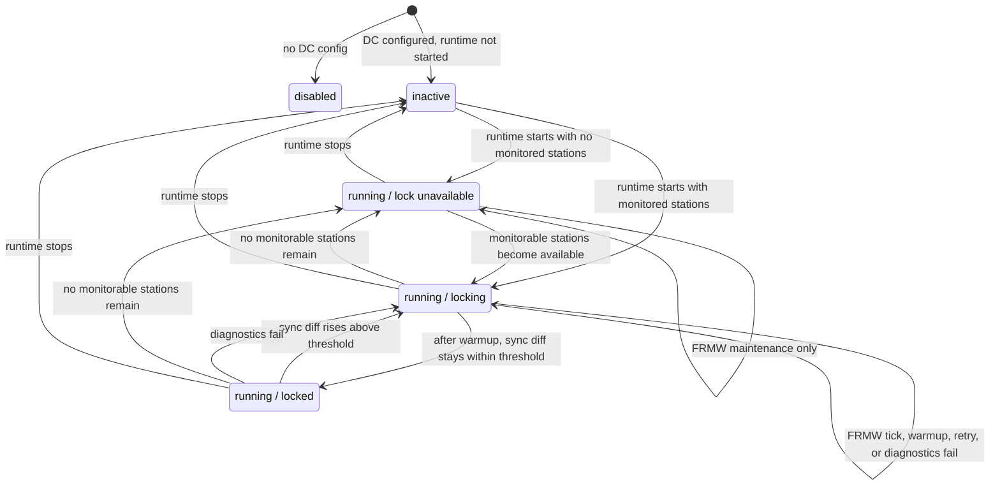

Distributed Clocks — clock initialization and runtime maintenance.

`EtherCAT.DC` is intentionally the runtime `gen_statem` state-machine module for network-wide
Distributed Clocks maintenance. One-time clock initialization, public API
wrappers, and runtime tick mechanics live in `EtherCAT.DC.*` helpers so the
main module can be inspected as the DC runtime state machine.

## State-Machine Boundary

`EtherCAT.DC` has one actual `gen_statem` state: `:running`. It owns the DC
runtime tick loop and the replies that expose current runtime status.

Initialization, tick mechanics, and status projection live in helpers such as
`EtherCAT.DC.Init`, `EtherCAT.DC.Runtime`, `EtherCAT.DC.State`, and
`EtherCAT.DC.API`.

## Initialization

`DC.API.initialize_clocks/2` performs the one-time clock synchronization
sequence described in ETG.1000 §9.1.3.6:

1. Trigger receive-time latch on all slaves (BWR to `0x0900`).
2. Read one DC snapshot per slave:
   - DL-status-derived active ports
   - receive time port 0..3
   - ECAT receive time
   - speed counter start
3. Identify the reference clock (first DC-capable slave in bus order).
4. Build a deterministic init plan:
   - chain-only propagation delay estimate from latched receive spans
   - per-slave system time offset against the EtherCAT epoch
   - PLL filter reset value
5. Apply offset + delay writes to every DC-capable slave.
6. Reset PLL filters by writing back the latched speed-counter seed.

The planning step is pure and covered by unit tests. The current topology model
is intentionally explicit: it supports a linear bus ordered by scan position.
More complex tree-delay propagation needs a richer topology graph than the
current master passes into DC init.

## Runtime maintenance

`EtherCAT.DC` is the runtime owner for network-wide Distributed Clocks state.
It sends its own realtime frame at the configured DC cycle:

- every tick: configured-address FRMW to the reference clock system time
  register (`0x0910`)
- every N ticks: append configured-address reads of `0x092C` on the monitored
  DC-capable slaves

That keeps DC ownership out of `Domain`. Domains stay process-image/LRW loops;
`DC` owns clock maintenance, lock classification, diagnostics, and waiters.

## Lock State Transitions

The chart below documents `EtherCAT.DC.Status.lock_state`, not a separate
`gen_statem` state machine.

