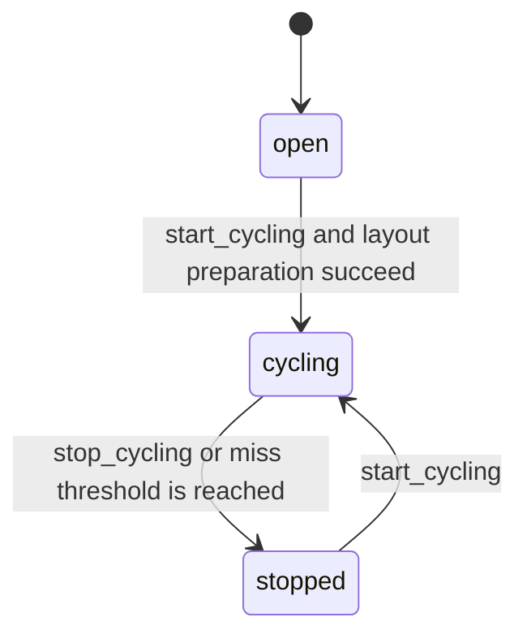

Cyclic process image for one logical EtherCAT domain.

One domain runs per configured domain ID. Slaves register their PDOs during
PREOP, then the domain runs a self-timed LRW exchange each cycle.

`EtherCAT.Domain` is the public boundary for the domain lifecycle. Its
internal `EtherCAT.Domain.FSM` process owns the `gen_statem` states, while
direct ETS access, cycle execution, image handling, and telemetry assembly
live behind the public module and internal domain helpers.

## State-Machine Boundary

`EtherCAT.Domain.FSM` owns only the actual domain states and their
transitions: open, cycling, and stopped. The state-machine module should not
inline cycle execution, process-image reads/writes, or telemetry assembly.

Those mechanics live in internal domain helpers, surfaced through the public
`EtherCAT.Domain` module.

## States

- `:open` — accepting PDO registrations, not yet cycling
- `:cycling` — self-timed LRW tick active
- `:stopped` — cycling halted (too many misses or manual stop)

## State Transitions

Within `:cycling`, domain health is tracked separately as `cycle_health`:

- `:healthy` — the latest LRW cycle was valid
- `:invalid` — the latest LRW cycle had a transport miss or invalid response

That health classification is runtime data, not a separate `gen_statem` state.

## Hot Path (Direct ETS)

    # Write output
    Domain.write(:my_domain, {:valve, :ch1}, <<0xFF>>)

    # Read current value
    Domain.read(:my_domain, {:sensor, :ch1})
    # => {:ok, binary} | {:error, :not_found | :not_ready}

Both bypass the gen_statem entirely via direct ETS access.

## Telemetry

- `[:ethercat, :domain, :cycle, :done]` —
  `%{duration_us, cycle_count, completed_at_us}`
- `[:ethercat, :domain, :cycle, :invalid]` —
  `%{total_invalid_count, invalid_at_us}`, metadata:
  `%{domain, reason, expected_wkc, actual_wkc, reply_count}` for bad-but-live cycle replies
- `[:ethercat, :domain, :cycle, :transport_miss]` —
  `%{consecutive_miss_count, total_invalid_count, invalid_at_us}`, metadata:
  `%{domain, reason, expected_wkc, actual_wkc, reply_count}` for timeout/down/unusable transport misses
