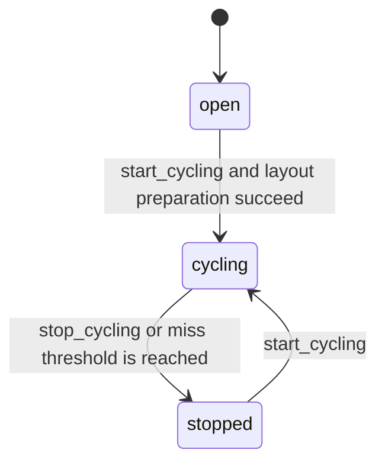

Cyclic process image for one logical EtherCAT domain.

One Domain runs per configured domain ID. Slaves register their PDOs during
PREOP, then the domain runs a self-timed LRW exchange each cycle.

`EtherCAT.Domain` is intentionally the `gen_statem` state-machine module for the domain
lifecycle. Direct ETS access and low-level control calls live in
`EtherCAT.Domain.API`, while cycle execution and image handling live in
`EtherCAT.Domain.*` helpers.

## State-Machine Boundary

`EtherCAT.Domain` owns only the actual domain states and their transitions:
open, cycling, and stopped. The state-machine module should not inline cycle execution,
process-image reads/writes, or telemetry assembly.

Those mechanics live in `EtherCAT.Domain.Cycle`, `EtherCAT.Domain.Image`,
`EtherCAT.Domain.Calls`, and `EtherCAT.Domain.Status`. `EtherCAT.Domain.API`
provides the direct ETS-backed low-level facade.

## States

- `:open` — accepting PDO registrations, not yet cycling
- `:cycling` — self-timed LRW tick active
- `:stopped` — cycling halted (too many misses or manual stop)

## State Transitions

Within `:cycling`, domain health is tracked separately as `cycle_health`:

- `:healthy` — the latest LRW cycle was valid
- `:invalid` — the latest LRW cycle had a transport miss or invalid response

That health classification is runtime data, not a separate `gen_statem` state.

## Hot Path (Direct ETS)

    # Write output
    Domain.API.write(:my_domain, {:valve, :ch1}, <<0xFF>>)

    # Read current value
    Domain.API.read(:my_domain, {:sensor, :ch1})
    # => {:ok, binary} | {:error, :not_found | :not_ready}

Both bypass the gen_statem entirely via direct ETS access.

## Telemetry

- `[:ethercat, :domain, :cycle, :done]` —
  `%{duration_us, cycle_count, completed_at_us}`
- `[:ethercat, :domain, :cycle, :missed]` —
  `%{miss_count, total_miss_count, invalid_at_us}`, metadata:
  `%{domain, reason}` for both invalid cycle responses and transport misses
