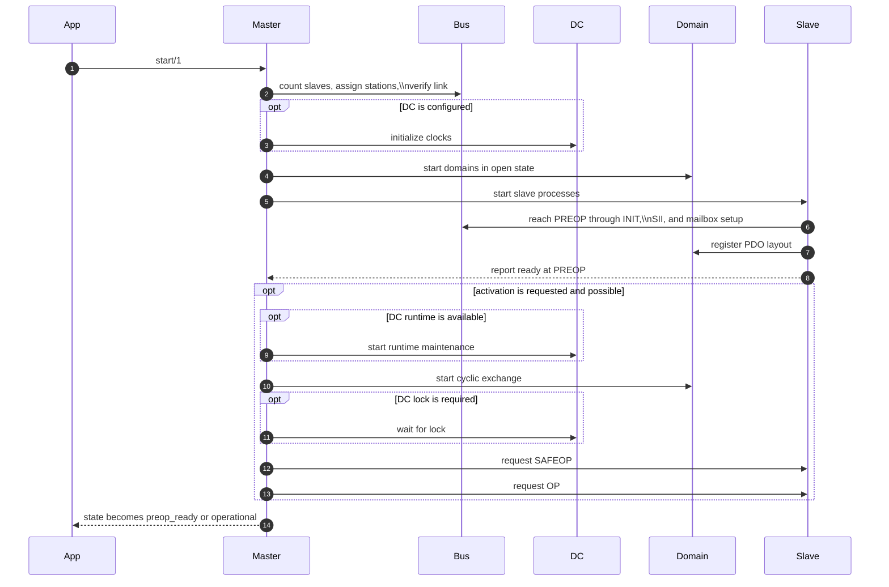
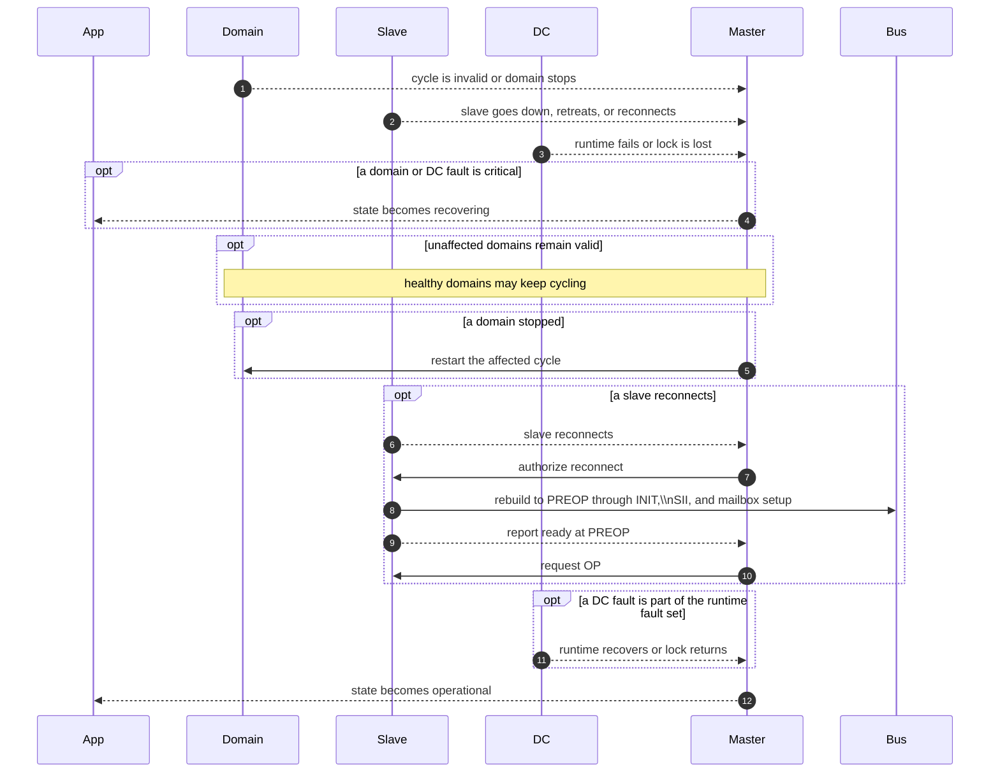
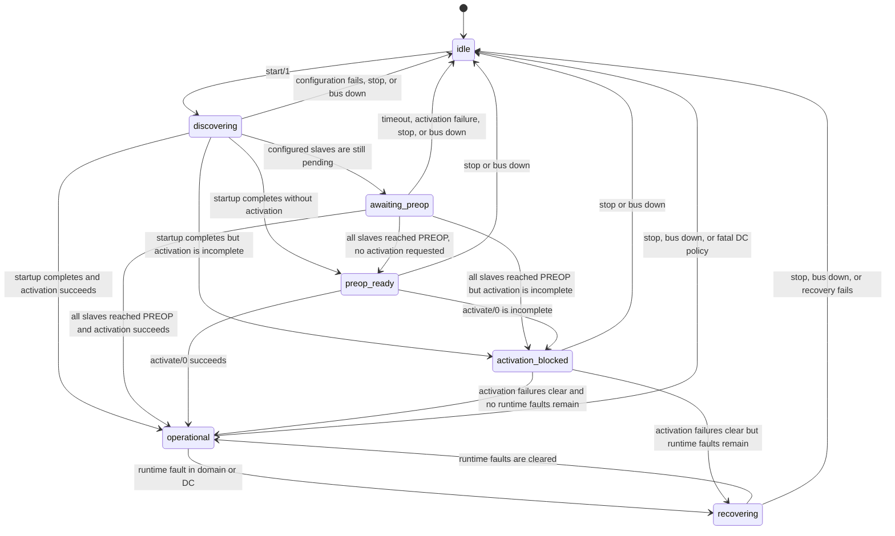

Master orchestrates startup, activation, and runtime recovery for the EtherCAT session.

This module is intentionally the `gen_statem` shell for the master lifecycle.
Protocol-heavy work lives in `EtherCAT.Master.*` helpers so the state machine
can be reviewed against the EtherCAT startup and continuous-loop model without
also wading through all implementation details inline.

The master owns the public lifecycle exposed via `EtherCAT.state/0`. Each state
maps 1:1 to an actual `EtherCAT.Master` `gen_statem` state.

## Lifecycle States

- `:idle` - No session active
- `:discovering` - Scanning the bus, counting slaves, assigning stations, and preparing startup
- `:awaiting_preop` - Waiting for configured slaves to reach PREOP
- `:preop_ready` - All slaves in PREOP, ready for activation or dynamic configuration
- `:operational` - Cyclic operation active; non-critical per-slave faults are tracked separately
- `:activation_blocked` - Activation incomplete (DC lock, slave failures, etc.)
- `:recovering` - Runtime fault detected and the master is healing critical runtime faults

## Startup Sequencing

## Runtime Fault Recovery

## State Transitions

