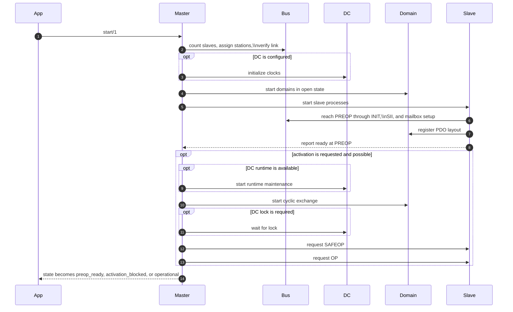
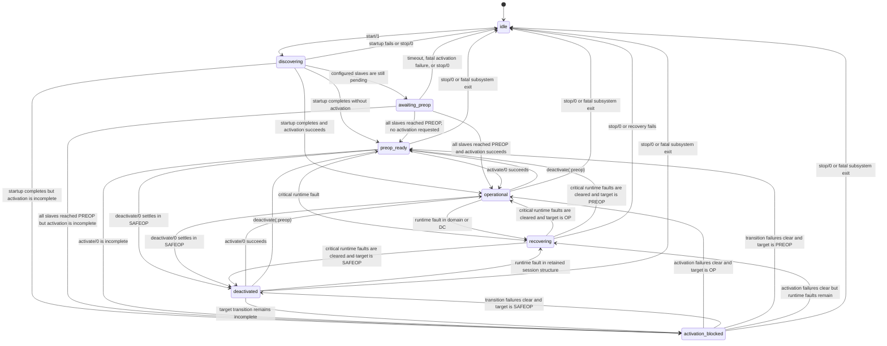

Master orchestrates startup, activation, and runtime recovery for the EtherCAT session.

This module is intentionally the `gen_statem` state-machine module for the
master lifecycle.
Protocol-heavy work lives in `EtherCAT.Master.*` helpers so the state machine
can be reviewed against the EtherCAT startup and continuous-loop model without
also wading through all implementation details inline.

The master owns the public lifecycle exposed via `EtherCAT.state/0`. Each state
maps 1:1 to an actual `EtherCAT.Master` `gen_statem` state.

## State-Machine Boundary

`EtherCAT.Master` should mention domains, slaves, and DC as session concepts:
their events, tracked refs, and the policy that decides the next master state.

It should not perform low-level subsystem mechanics inline. Calls like
requesting slave transitions, authorizing reconnects, starting/stopping
domains, or querying DC runtime status belong in `EtherCAT.Master.*` helpers
such as `Activation`, `Recovery`, `Status`, `Calls`, and `Startup`.

That split is deliberate: the state-machine module stays readable as a session
state machine, while the helpers own the operational detail.

## Lifecycle States

- `:idle` - No session active
- `:discovering` - Scanning the bus, counting slaves, assigning stations, and preparing startup
- `:awaiting_preop` - Waiting for configured slaves to reach PREOP
- `:preop_ready` - All slaves in PREOP, ready for activation or dynamic configuration
- `:deactivated` - Session stays live but the desired runtime target is intentionally below OP
- `:operational` - Cyclic operation active; non-critical per-slave faults are tracked separately
- `:activation_blocked` - Transition to the desired runtime target is incomplete
- `:recovering` - Runtime fault detected and the master is healing critical runtime faults

## Startup Sequencing

## Runtime Fault Recovery

## State Transitions

Physical link loss normally moves the master into `:recovering` through
domain/DC runtime faults. A direct transition to `:idle` is reserved for
explicit stop, startup failure, bus-process exit, or fatal policy.
