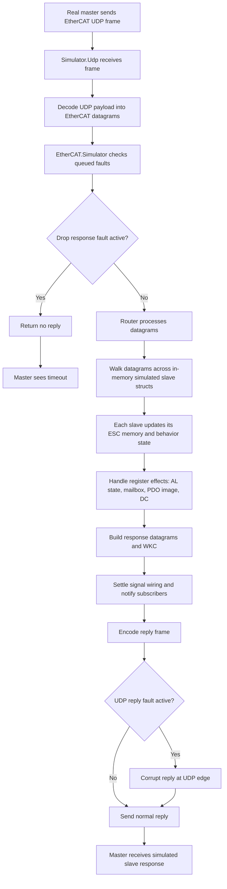

Simulated EtherCAT segment for deep integration tests and virtual hardware.

`EtherCAT.Simulator` hosts one or more simulated slaves and executes EtherCAT
datagrams against them with protocol-faithful register, AL-state, mailbox, and
logical process-data behavior.

It is the public process boundary for the simulator runtime. Device builders,
signal-level control, and signal wiring live in `EtherCAT.Simulator.Slave`,
while the real UDP endpoint lives in `EtherCAT.Simulator.Udp`.

For the full implementation guide and the SOES-derived simulator notes, see:

- `lib/ethercat/simulator/README.md`
- `lib/ethercat/simulator/slave/reference/slave_spec/README.md`

## Purpose

The simulator exists for:

- deep integration tests without physical hardware
- local virtual hardware during development
- higher-level tooling such as a future simulator widget in `kino_ethercat`

The intended runtime path stays realistic:

- real `EtherCAT.start/1`
- real `EtherCAT.Bus`
- real single-port bus link handling
- real `EtherCAT.Bus.Transport.UdpSocket`
- simulated slaves behind a real UDP endpoint

## Runtime Flow

The simplified exchange path looks like this:



## State-Machine Boundary

`EtherCAT.Simulator` is intentionally a small process boundary over the
multi-slave segment state.

It owns:

- the simulated slave list
- datagram execution across that list
- WKC accumulation
- injected runtime faults
- signal subscriptions for tooling

It should not own device-profile logic inline. That lives in the simulator's
private slave runtime and profile modules under `lib/ethercat/simulator/slave/`.

## Public API Shape

Main entry points:

- `start/1` — start the public supervised simulator runtime
- `child_spec/1` — supervisor-friendly form of `start/1`, including `udp: [...]`
- `start_link/1` — low-level in-memory simulator core only
- `stop/0` — stop the singleton simulator runtime
- `process_datagrams/1` — execute EtherCAT datagrams directly
  and return `{:error, :no_response}` when an injected runtime fault consumes
  the reply
- `inject_fault/1` / `clear_faults/0` — deterministic fault injection through
  `EtherCAT.Simulator.Fault`
- `info/0`, `device_snapshot/1`, `signal_snapshot/2`, `connections/0`
  — stable runtime snapshots for tooling
- `signals/1`, `signal_definitions/1`, `get_value/2`, `set_value/3`
- `connect/2`, `disconnect/2`, `connections/0` — cross-slave signal wiring
- `subscribe/3` / `unsubscribe/3` — widget-friendly signal observation

Use `EtherCAT.Simulator.Slave` to build devices such as:

- digital I/O
- couplers
- mailbox-capable demo slaves
- analog and temperature devices
- servo/drive profiles
- or simulated devices hydrated from a real `EtherCAT.Slave.Driver` through
  `from_driver/2`

`EtherCAT.Simulator.Slave.Definition` is the public opaque authored device
type used by those builders and optional driver hydration.

`info/0` also exposes queued fault visibility for tooling and tests through:

- `next_fault`
- `pending_faults`
- `scheduled_faults`
- `udp` transport info when the UDP endpoint is running

## Fault Injection

The simulator supports deterministic runtime faults for integration coverage:

- dropped responses
- wrong WKC
- named slave disconnect/reconnect
- forced `SAFEOP` retreat
- AL error latch
- mailbox abort replies

This allows deep recovery tests against the real master/runtime without
physical hardware.

Direct mailbox-local faults stay armed until `clear_faults/0`. When the same
mailbox protocol fault is injected as a non-wait step inside `Fault.script/1`,
the script treats it as a one-shot step and consumes it on first match so
later master retries can self-heal without extra simulator cleanup.

For datagram/runtime faults, prefer `EtherCAT.Simulator.Fault` with
`EtherCAT.Simulator.inject_fault/1`.

The builder covers both:

- sticky faults such as `:drop_responses` or `{:disconnect, :outputs}`
- exchange-scoped wrappers such as `Fault.next(fault)` and
  `Fault.script([step, ...])`
- delayed scheduling through `Fault.after_ms(fault, delay_ms)`
- milestone scheduling through `Fault.after_milestone(fault, milestone)`

The current exchange-scoped fault set is:

- `:drop_responses`
- `{:wkc_offset, delta}`
- `{:command_wkc_offset, command_name, delta}`
- `{:logical_wkc_offset, slave_name, delta}`
- `{:disconnect, slave_name}`

These queueable faults are the ones that change datagram/runtime outcomes over
successive exchanges.

Slave-local mutations can still be injected directly, or scheduled for later:

- `{:retreat_to_safeop, slave_name}`
- `{:latch_al_error, slave_name, code}`
- `{:mailbox_abort, slave_name, index, subindex, abort_code}`
- `{:mailbox_abort, slave_name, index, subindex, abort_code, :upload_segment}`
- `{:mailbox_abort, slave_name, index, subindex, abort_code, :download_segment}`
- `{:mailbox_protocol_fault, slave_name, index, subindex, stage, fault_kind}`

Current milestones include:

- `{:healthy_exchanges, count}`
- `{:healthy_polls, slave_name, count}`
- `{:mailbox_step, slave_name, step, count}`

That split is deliberate. Exchange-scoped wrappers model transport/runtime fault
windows, while delayed scheduling lets tests combine them with later slave-local
state changes without relying on brittle sleeps alone.

Typical queued runtime examples:

```elixir
alias EtherCAT.Simulator.Fault

EtherCAT.Simulator.inject_fault(Fault.drop_responses() |> Fault.next(10))

EtherCAT.Simulator.inject_fault(
  Fault.wkc_offset(-1)
  |> Fault.next(6)
)

EtherCAT.Simulator.inject_fault(
  Fault.command_wkc_offset(:fprd, -1)
  |> Fault.next(30)
)

EtherCAT.Simulator.inject_fault(
  Fault.logical_wkc_offset(:outputs, -1)
  |> Fault.next(6)
)

EtherCAT.Simulator.inject_fault(
  Fault.script([Fault.drop_responses(), Fault.wkc_offset(-1)])
)

EtherCAT.Simulator.inject_fault(
  Fault.retreat_to_safeop(:outputs)
  |> Fault.after_ms(250)
)

EtherCAT.Simulator.inject_fault(
  Fault.retreat_to_safeop(:outputs)
  |> Fault.after_milestone(Fault.healthy_polls(:outputs, 10))
)

EtherCAT.Simulator.inject_fault(
  Fault.mailbox_abort(:mailbox, 0x2003, 0x01, 0x0800_0000, stage: :upload_segment)
  |> Fault.after_milestone(Fault.mailbox_step(:mailbox, :upload_segment, 2))
)

EtherCAT.Simulator.inject_fault(
  Fault.mailbox_protocol_fault(:mailbox, 0x2003, 0x01, :upload_segment, :toggle_mismatch)
)

EtherCAT.Simulator.inject_fault(
  Fault.mailbox_protocol_fault(:mailbox, 0x2003, 0x01, :download_segment, :drop_response)
)

EtherCAT.Simulator.inject_fault(
  Fault.mailbox_protocol_fault(:mailbox, 0x2001, 0x01, :upload_init, {:mailbox_type, 0x04})
)

EtherCAT.Simulator.inject_fault(
  Fault.mailbox_protocol_fault(:mailbox, 0x2001, 0x01, :upload_init, {:sdo_command, 0x60})
)

EtherCAT.Simulator.inject_fault(
  Fault.mailbox_protocol_fault(:mailbox, 0x2003, 0x01, :upload_segment, {:segment_command, 0x20})
)

EtherCAT.Simulator.inject_fault(
  Fault.script([
    Fault.drop_responses(),
    Fault.wait_for(Fault.healthy_polls(:outputs, 10)),
    Fault.retreat_to_safeop(:outputs)
  ])
)

EtherCAT.Simulator.inject_fault(
  Fault.script(
    List.duplicate(Fault.disconnect(:mailbox), 30) ++
      [Fault.mailbox_abort(:mailbox, 0x2000, 0x02, 0x0601_0002)]
  )
)

EtherCAT.Simulator.inject_fault(
  Fault.mailbox_protocol_fault(:mailbox, 0x2003, 0x01, :download_segment, :drop_response)
  |> Fault.after_milestone(Fault.mailbox_step(:mailbox, :download_segment, 1))
)
```

Transport-edge reply corruption is intentionally separate from those runtime
faults.

- Use `EtherCAT.Simulator` fault injection for datagram/runtime behavior.
- Use `EtherCAT.Simulator.Udp` with `EtherCAT.Simulator.Udp.Fault` for
  malformed or mismatched raw EtherCAT UDP replies.
- Use `Fault.describe/1` and `EtherCAT.Simulator.Udp.Fault.describe/1` in
  external tooling instead of rebuilding labels from tuple shapes.

## Transport Split

`EtherCAT.Simulator` itself is transport-agnostic.

- `EtherCAT.Simulator.Udp` exposes it over a real UDP socket.
- `EtherCAT.Simulator.Udp.inject_fault/1` can corrupt the next UDP reply, a
  counted reply window, or a scripted sequence of replies for integration
  coverage of bus decode and reply-matching paths.
- `start/1` accepts `udp: [...]` when the common simulator-plus-UDP setup
  should run under the simulator supervisor.
- Raw-socket simulation is intentionally separate and not part of this module.
