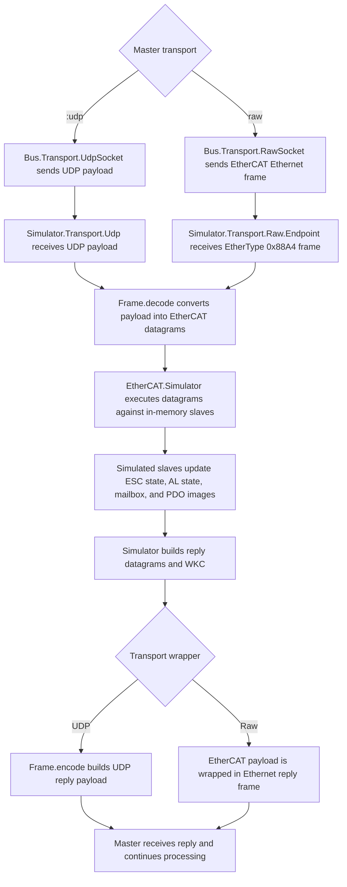

Simulated EtherCAT slave segment for deep integration tests, virtual hardware,
and simulator-backed tooling.

`EtherCAT.Simulator` executes EtherCAT datagrams against one or more in-memory
slaves with protocol-faithful ESC register, AL-state, mailbox, and logical
process-data behavior. It is the public process boundary for the simulator
runtime; device authorship lives in `EtherCAT.Simulator.Slave`, and the real
transport endpoints live in `EtherCAT.Simulator.Transport.Udp` and
`EtherCAT.Simulator.Transport.Raw`.

## What This Is Not

This is not a hardware EtherCAT slave controller or a kernel-bypass slave NIC.

The simulator can now expose two host-side ingress styles through an explicit
`backend:`:

- `backend: {:udp, %{host: ..., port: ...}}` through `EtherCAT.Simulator.Transport.Udp`
- `backend: {:raw, %{interface: ...}}` through `EtherCAT.Simulator.Transport.Raw`
- `backend: {:redundant, %{primary: {:raw, ...}, secondary: {:raw, ...}}}`
  for redundant raw ingress against one shared slave segment

In both cases, the slave segment is still userspace Elixir code that decodes
EtherCAT datagrams, executes them against in-memory slaves, and encodes the
reply. The raw mode is a host raw-socket endpoint, not a claim that the
simulator is acting like a physical ESC.

## Purpose

The simulator exists for:

- deep integration tests without physical hardware
- local virtual hardware during development
- higher-level tooling such as a future simulator widget in `kino_ethercat`

Real hardware is not required for most tests because the code under test is
still the real master, bus, link handling, and UDP transport. What gets
virtualized is the slave segment. That is exactly where determinism helps:
disconnects, bad WKCs, mailbox faults, retries, and recovery timing are easier
to reproduce and assert in the simulator than on a physical bench.

Hardware runs still matter, but mainly as a complement:

- smoke validation on a real ring
- capture generation
- simulator-drift checks

## Runtime Flow

The exchange path is intentionally simple. The simulator core is the same in
both modes; only the outer transport wrapper changes.



The important boundary is that only the master-side EtherCAT logic is "real"
here. On the simulator side, both endpoints are just transport adapters around
the same in-memory slave segment.

## Architecture

`EtherCAT.Simulator` is intentionally a small process boundary over the
multi-slave segment state.

It owns:

- the simulated slave list
- datagram execution across that list
- WKC accumulation
- injected runtime faults
- signal subscriptions and snapshots for tooling
- optional supervision of UDP or raw transport endpoints

It does not own device-profile logic inline. That lives in the simulator's
private slave runtime and profile modules under `lib/ethercat/simulator/slave/`.

Runtime implementation shape:

```text
lib/ethercat/
├── simulator.ex
└── simulator/
    ├── driver_adapter.ex
    ├── fault.ex
    ├── runtime/
    │   ├── faults.ex
    │   ├── milestones.ex
    │   ├── router.ex
    │   ├── snapshot.ex
    │   ├── subscriptions.ex
    │   └── wiring.ex
    ├── transport.ex
    ├── transport/
    │   ├── raw.ex
    │   ├── raw/
    │   │   ├── endpoint.ex
    │   │   └── fault.ex
    │   ├── udp.ex
    │   └── udp/
    │       └── fault.ex
    └── slave/
        ├── behaviour.ex
        ├── definition.ex
        ├── driver.ex
        ├── object.ex
        ├── profile.ex
        ├── signals.ex
        ├── value.ex
        └── reference/
```

Unlike SOES, there is no embedded polling loop equivalent to `ecat_slv()`.
Incoming EtherCAT datagrams drive the simulator state:

- register reads and writes
- AL control and status transitions
- EEPROM/SII reads
- SyncManager and FMMU programming
- logical process-data access

That is deliberate. The simulator preserves the observable protocol boundary,
not the C control flow.

## Fidelity Boundary

These protocol-facing parts should stay aligned with the spec model and any
local simulator reference notes kept outside the tracked repo:

- datagram routing:
  - broadcast
  - auto-increment
  - fixed-address
  - logical
- register reads and writes
- AL control and status behavior
- EEPROM/SII read behavior
- SyncManager and FMMU state
- logical process-data read and write behavior
- WKC accounting

Intentionally simplified:

- embedded polling-loop shape from SOES
- HAL and firmware-driver structure
- hardware interrupt behavior
- link-carrier modeling below the protocol layer
- full DC behavior

The rule is: preserve protocol behavior, not firmware structure.

## Public API

Main entry points:

- `start/1` — start the supervised simulator runtime against an explicit
  `backend: ...` when you want a real transport endpoint
- `child_spec/1` — supervisor-friendly form of `start/1`
- `start_link/1` — low-level in-memory simulator core only
- `stop/0` — stop the singleton simulator runtime
- `status/0` — stable machine-readable `%EtherCAT.Simulator.Status{}`
- `process_datagrams/1` — execute EtherCAT datagrams directly
- `process_datagrams/2` — execute EtherCAT datagrams with simulator-local
  options such as raw ingress side
- `inject_fault/1` / `clear_faults/0` — deterministic runtime fault injection
- `set_topology/1` — switch the simulator between linear and redundant
  topology modes, including a deterministic single break
- `info/0`, `device_snapshot/1`, `signal_snapshot/2`, `connections/0`
  — lower-level runtime snapshots for tooling and transport detail
- `signals/1`, `signal_definitions/1`, `get_value/2`, `set_value/3`
- `connect/2`, `disconnect/2` — cross-slave signal wiring
- `subscribe/3` / `unsubscribe/3` — widget-friendly signal observation

Use `EtherCAT.Simulator.Slave` to build devices such as:

- digital I/O
- couplers
- mailbox-capable demo slaves
- analog and temperature devices
- servo and drive profiles
- simulated devices hydrated from a real `EtherCAT.Driver` through
  `from_driver/2`

`EtherCAT.Simulator.Slave.Definition` is the public opaque authored device type
used by those builders and optional driver hydration.

## Capabilities

The simulator is already strong enough to exercise the real master through:

- startup to `:operational`
- cyclic I/O roundtrips
- PREOP mailbox diagnostics
- recovery from realistic runtime faults

Implemented and validated surface:

- one or more simulated slaves behind one named simulator instance
- real UDP transport path through `EtherCAT.Bus.Transport.UdpSocket`
- single-link raw transport path through `EtherCAT.Bus.Transport.RawSocket`
- dual raw ingress endpoints for redundant master tests
- redundant topology modeling:
  - healthy secondary passthrough
  - deterministic single break through `set_topology({:redundant, break_after: n})`
- startup addressing modes:
  - broadcast
  - auto-increment
  - fixed-address
  - logical
- AL transition discipline:
  - `INIT -> PREOP -> SAFEOP -> OP`
- SII/EEPROM reads through the normal master path
- SyncManager and FMMU programming
- cyclic LRW process-data exchange
- expedited and segmented CoE upload/download for mailbox-capable devices
- signal-level get/set, subscriptions, and snapshots for tooling
- cross-slave signal wiring
- real-device hydration through simulator companions on real drivers

The preferred public device story is driver-backed simulation:

```elixir
coupler = EtherCAT.Simulator.Slave.from_driver(MyApp.EK1100, name: :coupler)
inputs = EtherCAT.Simulator.Slave.from_driver(MyApp.EL1809, name: :inputs)
outputs = EtherCAT.Simulator.Slave.from_driver(MyApp.EL2809, name: :outputs)
```

Profile modules still exist, but they are implementation detail. The public
story is: simulate real devices through real drivers and keep identity, PDO
naming, and simulator hydration aligned.

## Fault Model

The simulator has three fault boundaries:

- `EtherCAT.Simulator` for datagram/runtime behavior
- `EtherCAT.Simulator.Transport.Udp` for malformed, stale, or mismatched UDP replies
- `EtherCAT.Simulator.Transport.Raw` for raw endpoint behavior such as
  delayed egress on one or both raw legs

Runtime fault injection supports:

- exchange-scoped faults such as dropped replies, WKC skew, and disconnects
- slave-local faults such as `SAFEOP` retreat, power-cycle resets, AL error
  latch, mailbox aborts, and mailbox protocol faults
- queued windows through `Fault.next/2`
- scripted sequences through `Fault.script/1`
- delayed activation through `Fault.after_ms/2`
- milestone activation through `Fault.after_milestone/2`

Current exchange-scoped runtime faults:

- `:drop_responses`
- `{:wkc_offset, delta}`
- `{:command_wkc_offset, command_name, delta}`
- `{:logical_wkc_offset, slave_name, delta}`
- `{:disconnect, slave_name}`

Current milestones:

- `{:healthy_exchanges, count}`
- `{:healthy_polls, slave_name, count}`
- `{:mailbox_step, slave_name, step, count}`

Current slave-local fault injections include:

- `{:power_cycle, slave_name}` — reset the slave to `INIT`, clear volatile
  runtime state, and clear its fixed station address so the slave reconnect
  path must reclaim or restore it before PREOP rebuild can continue
- `{:latch_al_error, slave_name, code}` — set the slave's AL error bit and
  status code without disconnecting it from the segment so runtime health
  handling can react to a live local fault
- `{:mailbox_abort, slave_name, index, subindex, abort_code}`
- `{:mailbox_abort, slave_name, index, subindex, abort_code, stage}`
- `{:mailbox_protocol_fault, slave_name, index, subindex, stage, fault_kind}`

Direct slave-local injections stay active until `clear_faults/0`. The same
mailbox protocol fault injected as a step inside `Fault.script/1` is consumed
on first match so reconnect/retry scenarios can fail once and self-heal on a
later master retry.

Example runtime and UDP-edge faults:

```elixir
alias EtherCAT.Simulator.Fault
alias EtherCAT.Simulator.Transport.Raw.Fault, as: RawFault
alias EtherCAT.Simulator.Transport.Udp.Fault, as: UdpFault

EtherCAT.Simulator.inject_fault(Fault.drop_responses() |> Fault.next(10))

EtherCAT.Simulator.inject_fault(
  Fault.retreat_to_safeop(:outputs)
  |> Fault.after_milestone(Fault.healthy_polls(:outputs, 10))
)

EtherCAT.Simulator.inject_fault(
  Fault.mailbox_protocol_fault(:mailbox, 0x2003, 0x01, :upload_segment, :toggle_mismatch)
)

EtherCAT.Simulator.Transport.Udp.inject_fault(
  UdpFault.script([UdpFault.unsupported_type(), UdpFault.replay_previous()])
)

EtherCAT.Simulator.Transport.Raw.inject_fault(
  RawFault.delay_response(200, endpoint: :secondary, from_ingress: :primary)
)
```

## Delay Semantics

The simulator currently supports delayed fault scheduling, not general
transport-latency simulation.

What exists today:

- `Fault.after_ms/2` delays when a fault becomes active
- `Fault.after_milestone/2` delays activation until a deterministic simulator
  milestone is observed
- `Transport.Raw.Fault.delay_response/2` delays raw response emission on
  selected endpoints for selected ingress directions
- the DC register model carries `system_time_delay_ns` so DC reads can expose
  realistic-looking delay values during clock setup and diagnostics

What does not exist today:

- no random jitter model
- no per-port or per-hop wire propagation model

That is deliberate. Most master regressions here are about missing replies,
wrong WKCs, malformed mailbox exchanges, reconnect sequencing, and retained
fault state. The raw transport delay control exists because raw redundant-path
regressions need an honest endpoint-level seam; broader latency models would
still be less useful than deterministic fault windows.

## Testing Strategy

Repository integration coverage keeps two maintained variants built around the
same real drivers:

- `test/integration/simulator/ring_test.exs`
- `test/integration/hardware/ring_test.exs`

The simulator suite is the primary place for deterministic fault matrices:

- transient timeouts and dropped replies
- UDP reply corruption, replay, and stale-frame behavior
- WKC mismatch and logical-slave-targeted skew
- slave disconnect/reconnect and `SAFEOP` retreat
- startup mailbox failures during PREOP configuration
- public SDO upload/download mailbox protocol faults
- reconnect-time PREOP rebuild failures
- telemetry-triggered chained recovery follow-ups
- captured real-device cases such as `EL3202`

Use fixture tiers deliberately:

- synthetic fixtures for protocol-isolated mailbox and reconnect matrices
- captured or curated real-device fixtures such as `EL3202` for realistic
  startup and decode behavior
- hardware tests as a final complement, not the only integration path

Prefer one simulator scenario per behavioral regression. Share helpers and ring
builders aggressively, but keep distinct fault stories in separate files so
failures localize cleanly.

## Reference Material

When you need deeper simulator design notes, use your local helper material
outside the tracked repo.

Relevant repo integration guides:

- `test/integration/simulator/README.md`
- `test/integration/hardware/README.md`

Historical planning material may exist in local helper notes outside the tracked
repo, but the maintained sources here are the current module docs, tests, and
integration guides.
