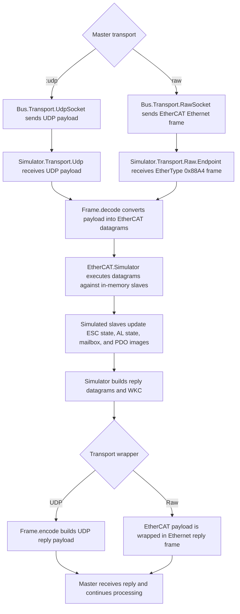

Simulated EtherCAT slave segment for deep integration tests, virtual hardware,
and simulator-backed tooling.

`EtherCAT.Simulator` executes EtherCAT datagrams against one or more in-memory
slaves with protocol-faithful ESC register, AL-state, mailbox, and logical
process-data behavior. It is the public process boundary for the simulator
runtime; device authorship lives in `EtherCAT.Simulator.Slave`, and the real
transport endpoints live in `EtherCAT.Simulator.Transport.Udp` and
`EtherCAT.Simulator.Transport.Raw`.

## What This Is Not

This is not a hardware EtherCAT slave controller or a kernel-bypass slave NIC.

The simulator exposes UDP or raw Ethernet ingress through an explicit
`backend:` (raw ingress can be single or redundant):

- `backend: {:udp, %{host: ..., port: ...}}` through `EtherCAT.Simulator.Transport.Udp`
- `backend: {:raw, %{interface: ...}}` through `EtherCAT.Simulator.Transport.Raw`
- `backend: {:redundant, %{primary: {:raw, ...}, secondary: {:raw, ...}}}`
  for redundant raw ingress against one shared slave segment

In all configurations, the slave segment is still userspace Elixir code that decodes
EtherCAT datagrams, executes them against in-memory slaves, and encodes the
reply. The raw mode is a host raw-socket endpoint, not a claim that the
simulator is acting like a physical ESC.

## Run a local UDP example

This standalone IEx example needs no physical devices or raw-socket privileges.
It defines a synthetic byte-wide loopback device, not a model of a vendor terminal.
The simulator binds an ephemeral UDP port on `127.0.0.2`; the master binds the
same port on `127.0.0.1`. Separate loopback addresses avoid a local port collision
on Linux. The returned backend supplies the actual port.

If your application already supervises `EtherCAT.Runtime`, omit the first two
lines and the final `Supervisor.stop(runtime)` call. Only one runtime and one
simulator may run per BEAM node.

```elixir
children = [{EtherCAT.Runtime, []}]
{:ok, runtime} = Supervisor.start_link(children, strategy: :one_for_one)

defmodule MyApp.SimulatedIO do
  @behaviour EtherCAT.Driver
  alias EtherCAT.Driver.Signal

  @impl true
  def signal_model(_config, _pdos) do
    [out: Signal.whole_pdo(0x1600), in: Signal.whole_pdo(0x1A00)]
  end

  @impl true
  def encode_signal(:out, _config, value) when is_integer(value) and value in 0..255,
    do: {:ok, <<value>>}

  def encode_signal(_name, _config, _value), do: {:error, :invalid_value}

  @impl true
  def decode_signal(:in, _config, <<value>>), do: {:ok, value}
  def decode_signal(_name, _config, _bytes), do: {:error, :invalid_data}
end

defmodule MyApp.SimulatedIO.Simulator do
  @behaviour EtherCAT.Simulator.Adapter

  @impl true
  def definition_options(_config), do: [profile: :digital_io]
end

{:ok, _simulator} = EtherCAT.Simulator.start(
  backend: {:udp, %{host: {127, 0, 0, 2}, port: 0}},
  devices: [EtherCAT.Simulator.Slave.from_driver(MyApp.SimulatedIO, name: :io)]
)

{:ok, %{backend: backend}} = EtherCAT.Simulator.status()
backend = %{backend | bind_ip: {127, 0, 0, 1}}
{:ok, session} = EtherCAT.start(
  backend: backend,
  dc: nil,
  domains: [%EtherCAT.Domain.Config{id: :main, cycle_time_us: 10_000}],
  slaves: [%EtherCAT.Slave.Config{
    name: :io, driver: MyApp.SimulatedIO, process_data: {:all, :main}
  }]
)

:ok = EtherCAT.await_operational(session)
{:ok, ref, _status, _samples} = EtherCAT.subscribe(session, :io)
:ok = EtherCAT.write(session, :io, :out, 42)

result = receive do
  {:ethercat, ^ref, %EtherCAT.Sample{inputs: %{in: 42}} = sample} -> {:ok, sample}
after
  2_000 -> {:error, :sample_timeout}
end
IO.inspect(result)

:ok = EtherCAT.unsubscribe(session, :io, ref)
:ok = EtherCAT.stop(session)
:ok = EtherCAT.Simulator.stop()
:ok = Supervisor.stop(runtime)
```

The `:digital_io` profile's default byte-image mode mirrors output to input.
This checks the real master, bus, codecs, and UDP exchange path. It does not prove
hardware timing, device compatibility, or real-world loopback wiring. In tests,
register cleanup with `on_exit/1` so failed assertions also stop the session and
simulator.

For direct synthetic definitions, use `EtherCAT.Simulator.Slave.Definition.build/2`.
For driver-backed devices, `from_driver/2` **requires** a simulator adapter:
`MyDriver.Simulator` by convention, or an explicit `simulator:` module option.
It cannot derive device behavior from `signal_model/2` alone.

## Purpose

The simulator exists for:

- deep integration tests without physical hardware
- local virtual hardware during development
- higher-level tooling such as a future simulator widget in `kino_ethercat`

Real hardware is not required for most tests because the code under test is
still the real master, bus, link handling, and UDP transport. What gets
virtualized is the slave segment. That is exactly where determinism helps:
disconnects, bad WKCs, mailbox faults, retries, and recovery timing are easier
to reproduce and assert in the simulator than on a physical bench.

Hardware runs still matter, but mainly as a complement:

- smoke validation on a real ring
- capture generation
- simulator-drift checks

## Runtime Flow

The exchange path is intentionally simple. The simulator core is the same in
both modes; only the outer transport wrapper changes.


```mermaid
flowchart TD
  A{Master transport}
  A -- :udp --> B[Bus.Transport.UdpSocket sends UDP payload]
  A -- raw --> C[Bus.Transport.RawSocket sends EtherCAT Ethernet frame]
  B --> D[Simulator.Transport.Udp receives UDP payload]
  C --> E[Simulator.Transport.Raw.Endpoint receives EtherType 0x88A4 frame]
  D --> F[Frame.decode converts payload into EtherCAT datagrams]
  E --> F
  F --> G[EtherCAT.Simulator executes datagrams against in-memory slaves]
  G --> H[Simulated slaves update ESC state, AL state, mailbox, and PDO images]
  H --> I[Simulator builds reply datagrams and WKC]
  I --> J{Transport wrapper}
  J -- UDP --> K[Frame.encode builds UDP reply payload]
  J -- Raw --> L[EtherCAT payload is wrapped in Ethernet reply frame]
  K --> M[Master receives reply and continues processing]
  L --> M
```

The important boundary is that only the master-side EtherCAT logic is "real"
here. On the simulator side, both endpoints are just transport adapters around
the same in-memory slave segment.

## Architecture

`EtherCAT.Simulator` is intentionally a small process boundary over the
multi-slave segment state.

It owns:

- the simulated slave list
- datagram execution across that list
- WKC accumulation
- injected runtime faults
- signal subscriptions and snapshots for tooling
- optional supervision of UDP or raw transport endpoints

It does not own device-profile logic inline. That lives in the simulator's
private slave runtime and profile modules under `lib/ethercat/simulator/slave/`.

Implementation entry points under `lib/ethercat/simulator/`:

| Path | Role |
|------|------|
| `adapter.ex`, `slave.ex`, `slave/definition.ex` | Public device authoring and driver hydration |
| `runtime/` | Segment routing, topology, faults, milestones, snapshots, wiring |
| `slave/runtime/`, `slave/profile/` | In-memory ESC/device behavior and profile defaults |
| `transport/udp.ex`, `transport/raw.ex` | Host-side transport endpoints |
| `fault.ex`, `transport/*/fault.ex` | Runtime and transport-specific fault builders |

Unlike SOES, there is no embedded polling loop equivalent to `ecat_slv()`.
Incoming EtherCAT datagrams drive the simulator state:

- register reads and writes
- AL control and status transitions
- EEPROM/SII reads
- SyncManager and FMMU programming
- logical process-data access

That is deliberate. The simulator preserves the observable protocol boundary,
not the C control flow.

## Fidelity Boundary

These protocol-facing parts should stay aligned with the spec model and any
local simulator reference notes kept outside the tracked repo:

- datagram routing:
  - broadcast
  - auto-increment
  - fixed-address
  - logical
- register reads and writes
- AL control and status behavior
- EEPROM/SII read behavior
- SyncManager and FMMU state
- logical process-data read and write behavior
- WKC accounting

Intentionally simplified:

- embedded polling-loop shape from SOES
- HAL and firmware-driver structure
- hardware interrupt behavior
- link-carrier modeling below the protocol layer
- full DC behavior

The rule is: preserve protocol behavior, not firmware structure.

## Public API

Main entry points:

- `start/1` — start the supervised simulator runtime against an explicit
  `backend: ...` when you want a real transport endpoint
- `child_spec/1` — supervisor-friendly form of `start/1`
- `start_link/1` — low-level in-memory simulator core only
- `stop/0` — stop the singleton simulator runtime
- `status/0` — stable machine-readable `%EtherCAT.Simulator.Status{}`; `backend: nil`
  means the simulator is running detached with no transport attached
- `process_datagrams/1` — execute EtherCAT datagrams directly
- `inject_fault/1` / `clear_faults/0` — deterministic runtime fault injection
- `set_topology/1` — switch the simulator between linear and redundant
  topology modes, including a deterministic single break
- `info/0`, `device_snapshot/1`, `signal_snapshot/2`, `connections/0`
  — lower-level runtime snapshots for tooling and transport detail
- `signals/1`, `signal_definitions/1`, `get_value/2`, `set_value/3`
- `connect/2`, `disconnect/2` — cross-slave signal wiring
- `subscribe/3` / `unsubscribe/3` — widget-friendly signal observation

Use `EtherCAT.Simulator.Slave.from_driver/2` with an adapter, or
`EtherCAT.Simulator.Slave.Definition.build/2` with a profile, for devices such as:

- digital I/O
- couplers
- mailbox-capable demo slaves
- analog and temperature devices
- servo and drive profiles
- simulated devices hydrated from a real `EtherCAT.Driver` through
  `from_driver/2`

`EtherCAT.Simulator.Slave.Definition` is the public authored device struct
used by those builders and optional driver hydration.

## Capabilities

The simulator is already strong enough to exercise the real master through:

- startup to `:operational`
- cyclic I/O roundtrips
- PREOP mailbox diagnostics
- recovery from realistic runtime faults

Implemented and validated surface:

- one or more simulated slaves behind one named simulator instance
- real UDP transport path through `EtherCAT.Bus.Transport.UdpSocket`
- single-link raw transport path through `EtherCAT.Bus.Transport.RawSocket`
- dual raw ingress endpoints for redundant master tests
- redundant topology modeling:
  - healthy secondary passthrough
  - deterministic single break through `set_topology({:redundant, break_after: n})`
- startup addressing modes:
  - broadcast
  - auto-increment
  - fixed-address
  - logical
- AL transition discipline:
  - `INIT -> PREOP -> SAFEOP -> OP`
- SII/EEPROM reads through the normal master path
- SyncManager and FMMU programming
- cyclic LRW process-data exchange
- expedited and segmented CoE upload/download for mailbox-capable devices
- signal-level get/set, subscriptions, and snapshots for tooling
- cross-slave signal wiring
- real-device hydration through simulator companions on real drivers

For real-device fixtures, keep driver identity, PDO mappings, codecs, and the
simulator adapter aligned. `EtherCAT.Capture` can generate structural scaffolds
from a device, but captured layout is not a complete behavior model. Profile
implementation modules are internal; author through the public definition or
adapter API.

## Fault Model

The simulator has three fault boundaries:

- `EtherCAT.Simulator` for datagram/runtime behavior
- `EtherCAT.Simulator.Transport.Udp` for malformed, stale, or mismatched UDP replies
- `EtherCAT.Simulator.Transport.Raw` for raw endpoint behavior such as
  delayed egress on one or both raw legs

Runtime fault injection supports:

- exchange-scoped faults such as dropped replies, WKC skew, and disconnects
- slave-local faults such as `SAFEOP` retreat, power-cycle resets, AL error
  latch, mailbox aborts, and mailbox protocol faults
- queued windows through `Fault.next/2`
- scripted sequences through `Fault.script/1`
- delayed activation through `Fault.after_ms/2`
- milestone activation through `Fault.after_milestone/2`

Current exchange-scoped runtime faults:

- `:drop_responses`
- `{:wkc_offset, delta}`
- `{:command_wkc_offset, command_name, delta}`
- `{:logical_wkc_offset, slave_name, delta}`
- `{:disconnect, slave_name}`

Current milestones:

- `{:healthy_exchanges, count}`
- `{:healthy_polls, slave_name, count}`
- `{:mailbox_step, slave_name, step, count}`

Current slave-local fault injections include:

- `{:power_cycle, slave_name}` — reset the slave to `INIT`, clear volatile
  runtime state, and clear its fixed station address so the slave reconnect
  path must reclaim or restore it before PREOP rebuild can continue
- `{:latch_al_error, slave_name, code}` — set the slave's AL error bit and
  status code without disconnecting it from the segment so runtime health
  handling can react to a live local fault
- `{:mailbox_abort, slave_name, index, subindex, abort_code}`
- `{:mailbox_abort, slave_name, index, subindex, abort_code, stage}`
- `{:mailbox_protocol_fault, slave_name, index, subindex, stage, fault_kind}`

Direct mailbox fault rules remain active until `clear_faults/0`. State-changing
faults such as power-cycle or SAFEOP retreat mutate the device when applied;
clearing faults does not undo that transition. A mailbox protocol fault inside
`Fault.script/1` is consumed on first match, allowing a retry to self-heal.

Fault snippets below assume an already-running fixture with the named devices;
they are independent examples, not a single recovery script. UDP/raw edge APIs
require their corresponding transport endpoint.

```elixir
alias EtherCAT.Simulator.Fault
alias EtherCAT.Simulator.Transport.Raw.Fault, as: RawFault
alias EtherCAT.Simulator.Transport.Udp.Fault, as: UdpFault

EtherCAT.Simulator.inject_fault(Fault.drop_responses() |> Fault.next(10))

EtherCAT.Simulator.inject_fault(
  Fault.retreat_to_safeop(:outputs)
  |> Fault.after_milestone(Fault.healthy_polls(:outputs, 10))
)

EtherCAT.Simulator.inject_fault(
  Fault.mailbox_protocol_fault(:mailbox, 0x2003, 0x01, :upload_segment, :toggle_mismatch)
)

EtherCAT.Simulator.Transport.Udp.inject_fault(
  UdpFault.script([UdpFault.unsupported_type(), UdpFault.replay_previous()])
)

EtherCAT.Simulator.Transport.Raw.inject_fault(
  RawFault.delay_response(200, endpoint: :secondary, from_ingress: :primary)
)
```

## Delay Semantics

The simulator supports delayed fault activation and selected raw-egress delays,
not a general transport-latency simulation.

What exists today:

- `Fault.after_ms/2` delays when a fault becomes active
- `Fault.after_milestone/2` delays activation until a deterministic simulator
  milestone is observed
- `Transport.Raw.Fault.delay_response/2` delays raw response emission on
  selected endpoints for selected ingress directions
- the DC register model carries `system_time_delay_ns` so DC reads can expose
  realistic-looking delay values during clock setup and diagnostics

What does not exist today:

- no random jitter model
- no per-port or per-hop wire propagation model

That is deliberate. Most master regressions here are about missing replies,
wrong WKCs, malformed mailbox exchanges, reconnect sequencing, and retained
fault state. The raw transport delay control exists because raw redundant-path
regressions need an honest endpoint-level seam; broader latency models would
still be less useful than deterministic fault windows.

## Testing Strategy

Repository integration coverage shares driver fixtures across:

- `test/integration/simulator/00_healthy_ring_transport_matrix_test.exs`
- `test/integration/hardware/ring_test.exs`

Run the hardware-free scenarios from a checkout with:

```bash
ETHERCAT_INTEGRATION_TRANSPORT=udp mix test test/integration/simulator --exclude raw_socket --exclude raw_socket_redundant --exclude raw_socket_redundant_toggle
```

Raw variants require dedicated Linux veth interfaces and raw-socket privileges;
link-toggle scenarios additionally need permission to change interface state.

The simulator suite is the primary place for deterministic fault matrices:

- transient timeouts and dropped replies
- UDP reply corruption, replay, and stale-frame behavior
- WKC mismatch and logical-slave-targeted skew
- slave disconnect/reconnect and `SAFEOP` retreat
- startup mailbox failures during PREOP configuration
- public SDO upload/download mailbox protocol faults
- reconnect-time PREOP rebuild failures
- telemetry-triggered chained recovery follow-ups
- captured real-device cases such as `EL3202`

Use fixture tiers deliberately:

- synthetic fixtures for protocol-isolated mailbox and reconnect matrices
- captured or curated real-device fixtures such as `EL3202` for realistic
  startup and decode behavior
- hardware tests as a final complement, not the only integration path

Prefer one simulator scenario per behavioral regression. Share helpers and ring
builders aggressively, but keep distinct fault stories in separate files so
failures localize cleanly.

## Reference Material

When you need deeper simulator design notes, use your local helper material
outside the tracked repo.

Relevant repo integration guides:

- [Simulator scenarios](https://github.com/sid2baker/ethercat/blob/main/test/integration/simulator/README.md)
- [Hardware bench guide](https://github.com/sid2baker/ethercat/blob/main/test/integration/hardware/README.md)

Historical planning material may exist in local helper notes outside the tracked
repo, but the maintained sources here are the current module docs, tests, and
integration guides.
