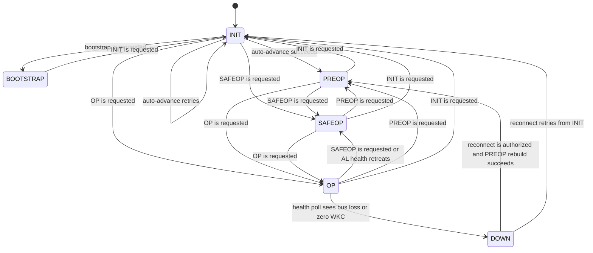

EtherCAT State Machine (ESM) lifecycle for one physical slave device.

This module is intentionally the `gen_statem` shell for one physical slave.
Bootstrap, transition walking, mailbox setup, process-data registration, health
polling, and signal delivery live in `EtherCAT.Slave.Runtime.*` helpers so the
main state machine can be inspected directly against the EtherCAT slave-state
model.

One `Slave` process is started per named slave and registered under
`{:slave, name}`. The slave owns INIT → PREOP → SAFEOP → OP transitions,
mailbox configuration, process-data SM/FMMU setup, and DC signal programming.

Typically driven by the master — use `EtherCAT.read_input/2`,
`EtherCAT.write_output/3`, and `EtherCAT.subscribe/3` from the top-level API.
Low-level direct access is available through `EtherCAT.Slave.API`.

## State Transitions

