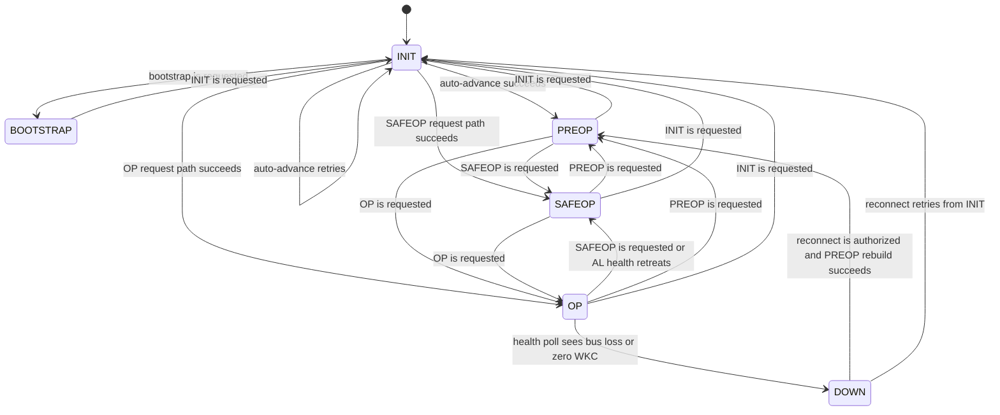

EtherCAT State Machine (ESM) lifecycle for one physical slave device.

`EtherCAT.Slave` is the public boundary for one physical slave. Its internal
`EtherCAT.Slave.FSM` process owns the `gen_statem` lifecycle, while bootstrap,
transition walking, mailbox setup, process-data registration, health polling,
and signal delivery live in `EtherCAT.Slave.Runtime.*` helpers.

One `Slave` process is started per named slave and registered under
`{:slave, name}`. The slave owns INIT → PREOP → SAFEOP → OP transitions,
mailbox configuration, process-data SM/FMMU setup, and DC signal programming.

Typically driven by the master — use `EtherCAT.read_input/2`,
`EtherCAT.write_output/3`, and `EtherCAT.subscribe/3` from the top-level API.
Direct slave-local calls are available through `EtherCAT.Slave`.

## State-Machine Boundary

`EtherCAT.Slave.FSM` owns the ESM-facing state machine and the decision about
which slave state should be entered next. Mailbox handling, process-data
planning, AL-path walking, output staging, health polling, and latch delivery
live in `EtherCAT.Slave.Runtime.*` and the other slave helper namespaces.

One consequence is that a request like `request(:op)` may walk the required
intermediate AL path internally, while the FSM itself changes state only once
that full path succeeds or fails.

## State Transitions

